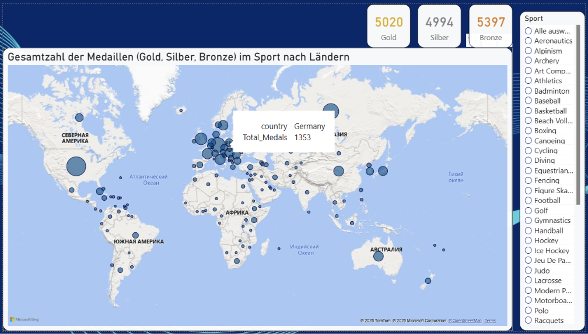

# Olympische Spiele: Medaillenerfolg 1904–2016

SQL-Datenmodell und Power-BI-Bericht aus einer Fallstudie im Kurs Data Analytics.

**Thema:** Welche Länder sind bei den Olympischen Sommerspielen langfristig am erfolgreichsten – und wie misst man Erfolg fair, wenn Mannschaftswettbewerbe sonst die Medaillenzahl aufblähen?

**Meine Rolle:** Datenimport in PostgreSQL, Sternschema, SQL-Analysen, DAX und Visualisierung. Der Bericht (`.pbix`) und das Datenmodell sind vollständig von mir erstellt.

## Bericht öffnen

Datei in [Power BI Desktop](https://www.microsoft.com/de-de/download/details.aspx?id=58494) öffnen:

`powerbi/OlympSpiele_Sinienko.pbix`

Die Daten sind im Bericht gespeichert (Import). PostgreSQL wird zum Öffnen nicht benötigt.

## Fragestellung

1. Welche Länder dominieren die Medaillenbilanz über die Geschichte der Sommerspiele?
2. Wie ändert sich das Bild, wenn Gold/Silber/Bronze nicht pro Athlet, sondern **pro Wettbewerb und Land** gezählt werden (eine Goldmedaille für die Mannschaft, nicht zwölf)?
3. Welche Länder sind nach dem **4-2-1-Punktesystem der New York Times** und nach einem Siegindex (Erfolg relativ zur Zahl der Wettbewerbe) vorne?
4. Welche Athletinnen und Athleten sind besonders effizient (Medaillen je Teilnahme)?

Zeitraum: **Sommerspiele 1904–2016** (26 Austragungen).

## Bericht

Fünf Seiten; Filterzustände (Jahr, Sport, Land) sind als zweite Datei festgehalten. Katalog: [`screenshots/README.md`](screenshots/README.md).

| Seite | Screenshot |
| --- | --- |
| 1 Langfristig erfolgreichste Länder | [alle Jahre](screenshots/1_Langfristig_erfolgreichstene_L%C3%A4nder.png) · [GER 2016, 5,6 %](screenshots/1_Langfristig_erfolgreichstene_DEU_2016.png) |
| 2 Medaillen weltweit | [alle Sportarten](screenshots/2_Gesamtzahl_der_Medaillen_Welt.png) · [Athletics / Germany](screenshots/2_Gesamtzahl_der_Medaillen_DEU_Atletics.png) |
| 3 4-2-1 und Siegindex | [alle Sportarten](screenshots/3_421-NYT_und_Siegindex_nach_Sport.png) · [Football](screenshots/3_421-NYT_und_Siegindex_nach_Football.png) |
| 4 Athleteneffizienz | [Phelps u. a.](screenshots/4_Athleteneffizienz.png) |
| 5 Effizienz Land | [Vergleich](screenshots/5_Effizienz_Land.png) · [Germany](screenshots/5_Effizienz_Land_DEU.png) |




## Datenmodell (kurz)

Sternschema in PostgreSQL, nach Power BI übernommen:

- Fakt `fact_results` (eine Zeile = eine Athletenleistung in einem Event/Jahr)
- Dimensionen Land, Sport, Event, Datum, Athlet, Athletenzustand je Saison
- SQL-View `view_olympic_medal_metrics` für land-/sport-/jahresscharfe Kennzahlen
- DAX-Tabellen `metrics` und `kontrol` für die Berichtskennzahlen

Ausführlich: [`docs/02-data-model.md`](docs/02-data-model.md). Entstehung: [`docs/01-process.md`](docs/01-process.md).

## Quellen

Rohdatei: [`data/raw/olympics_rohDaten.csv`](data/raw/olympics_rohDaten.csv) (Kursdatensatz der Fallstudie).

Strukturell angelehnt an den öffentlichen Datensatz [120 years of Olympic history: athletes and results](https://www.kaggle.com/datasets/heesoo37/120-years-of-olympic-history-athletes-and-results) (ursprünglich sports-reference.com). In diesem Ausschnitt: 216 784 Athleten-Event-Zeilen, 114 109 Athletinnen/Athleten, 228 NOCs, 49 Sportarten, 575 Events.

## Werkzeuge

PostgreSQL / pgAdmin, SQL, Python (Importskizze), Power Query, Power BI Desktop, DAX.

## Ordner

```text
powerbi/              Power-BI-Datei
sql/                  Tabellen, Views, Analysen
scripts/              CSV-Import nach PostgreSQL
data/raw/             Rohdaten
data/star-schema/     exportierte Dimensionen und Fakt
data/metrics/         SQL-Ergebnisse (4-2-1, Medaillen je Event)
screenshots/          Berichtsseiten und ERD
docs/                 Prozess (01) und Datenmodell (02)
```
